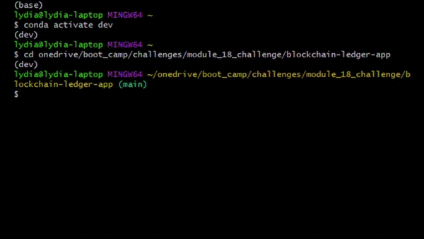
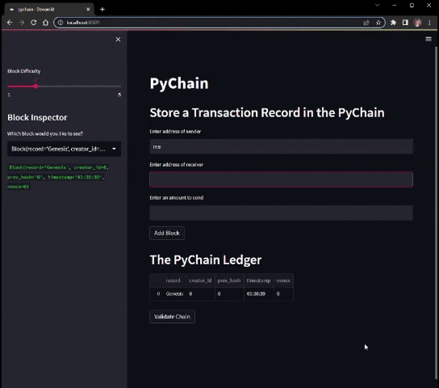

# Blockchain Ledger App
This Streamlit web application simulates financial transactions and stores them in a blockchain ledger. Each block in the chain is assigned a unique hash. The validity of the ledger can be verified by checking to see if each block in the chain is storing the correct hash of the previous block.

## How it Works
The application has three dataclasses: `Record`, `Block`, and `Pychain`.

The `Record` class stores information the user enters which will be entered into the record as plain text.
```python
@dataclass
class Record:
    sender: str
    receiver: str
    amount: float
```

The `Block` class's attributes represent the contents of each block. It also contains a function that encodes each attribute and assigns the block a unique hash.
```python
@dataclass
class Block:
    #user inputs for the record
    record: Record
    #the block's creator ID which is set to be an integer
    creator_id: int
    #the hash of the previous block which will be used to chain the blocks together
    prev_hash: str = "0"
    #timestamp is set to the time that the block was created
    timestamp: str = datetime.datetime.utcnow().strftime("%H:%M:%S")
    #nonce for completing proof of work
    nonce: int = 0

    def hash_block(self):
        #use the sha256 hashing function to create a hash
        sha = hashlib.sha256()
        #encode the block attributes
        record = str(self.record).encode()
        sha.update(record)

        creator_id = str(self.creator_id).encode()
        sha.update(creator_id)

        timestamp = str(self.timestamp).encode()
        sha.update(timestamp)

        prev_hash = str(self.prev_hash).encode()
        sha.update(prev_hash)

        nonce = str(self.nonce).encode()
        sha.update(nonce)

        return sha.hexdigest()
```

The `Pychain` dataclass defines the chain that connects the blocks and contains functions responsible for adding each block to the chain, assigning proof of work that each block must complete in order to be added, and varifying the integrity of the chain.
```python
@dataclass
class PyChain:
    chain: List[Block]
    difficulty: int = 4
    #proof of work function that must be completed to add a block to the chain
    def proof_of_work(self, block):
        #assign the hash of the candidate block to a variable
        calculated_hash = block.hash_block()
        #set the proof of work requirement to a certain number of zeros
        num_of_zeros = "0" * self.difficulty
        #increment the nonce of the block until it returns a hash that meets the requirement
        while not calculated_hash.startswith(num_of_zeros):
            block.nonce += 1
            calculated_hash = block.hash_block()
        #print the winning hash
        print("Winning Hash", calculated_hash)
        return block
    #add the block to the chain
    def add_block(self, candidate_block):
        block = self.proof_of_work(candidate_block)
        self.chain += [block]
    #validation function
    def is_valid(self):
        #calculate the hash of the first block in the chain
        block_hash = self.chain[0].hash_block()
        #check the hashes of the remaining blocks in the chain
        #if the hashes don't match, return False
        for block in self.chain[1:]:
            if block_hash != block.prev_hash:
                print("Blockchain is invalid!")
                return False

            block_hash = block.hash_block()
        #if hashes match, return True
        print("Blockchain is Valid")
        return True
```

I used Streamlit to deploy the application as a web app. Streamlit is a python library that makes it easy to interact with your python code in the cloud without having to write HTML or JavaScript. For example, this code creates a button which the user can click to add a block to the ledger:
```python
if st.button("Add Block"):
    prev_block = pychain.chain[-1]
    prev_block_hash = prev_block.hash_block()
    new_block = Block(
        record=Record(sender, receiver, amount),
        creator_id=42,
        prev_hash=prev_block_hash
    )

    pychain.add_block(new_block)
    st.balloons()
```

## Installation and Usage
To install and run the application, clone the repository to your local machine. You must have Streamlit installed in order to run the application in your browser. Click [here](https://docs.streamlit.io/library/get-started/installation) for instructions on how to install Streamlit.

In your terminal, navigate to the directory containing the `pychain.py` file, and type `streamlit run pychain.py`. This should open up the application in your browser.


After launching the application, you will be able to interact with its features from your browser. To add a block to the chain, type something into each of the input boxes, press "enter" to apply your changes, and click the "Add Block" button. This will add a block with your inputs to the Pychain ledger. After adding blocks, you can click the "Validate Chain" button which will test the hashes of each block to ensure the chain is valid. From the sidebar, you can select a block from the dropdown menu to inspect its contents.



---

## Technologies
* Python 3.7.15
* Python libraries: Streamlit, Dataclasses, Typing, Datetime, Pandas, Hashlib

---

## Contributors
Lydia Ciummo

---

## License
GNU General Public License v3.0